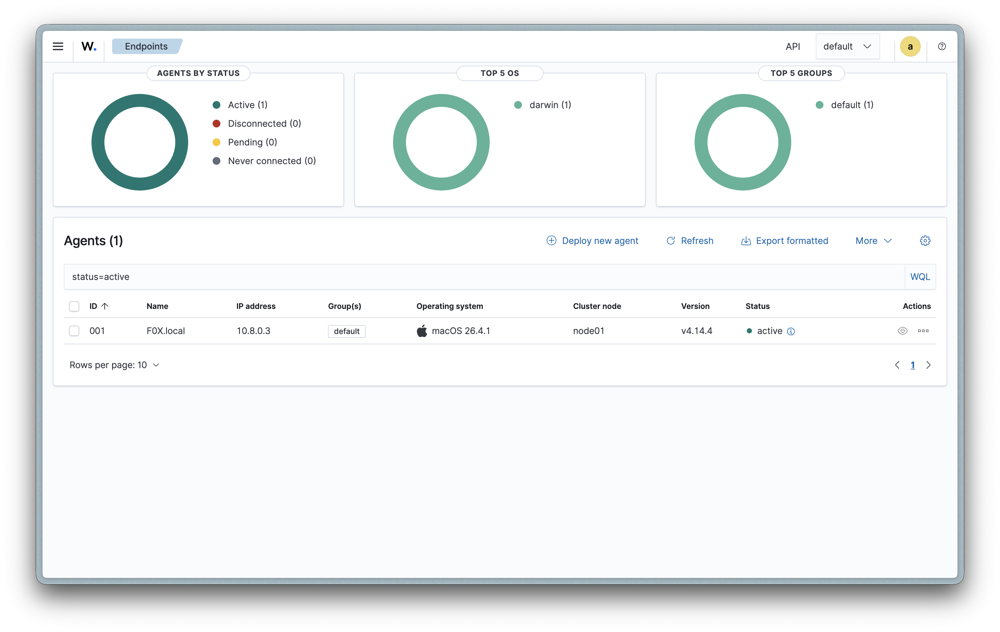
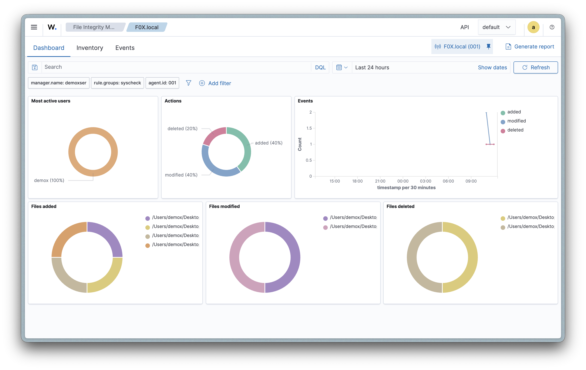
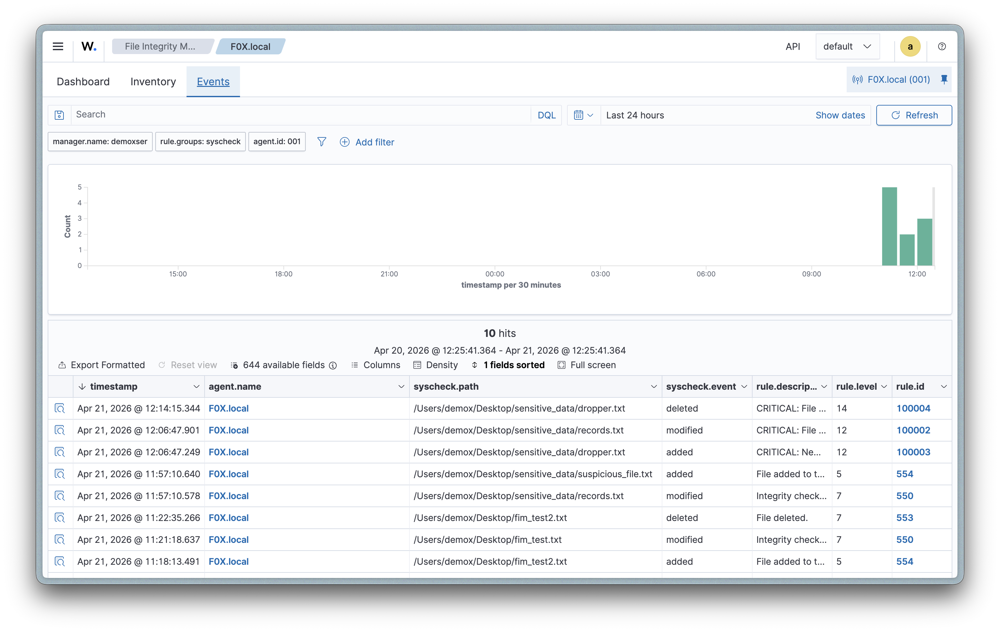
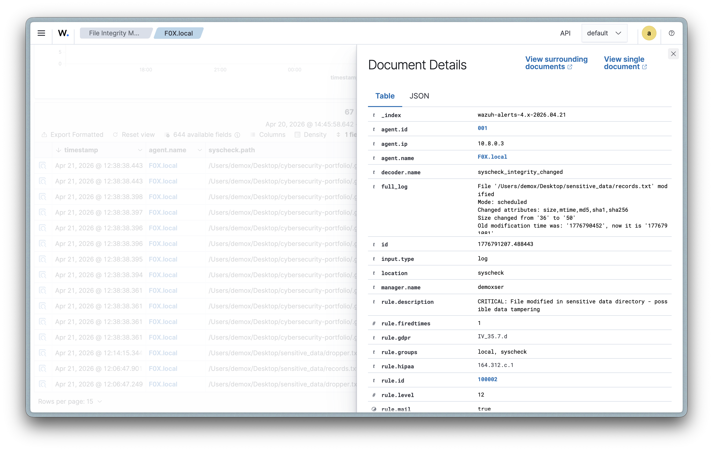

# Cybersecurity Home Lab Portfolio

A hands-on cybersecurity portfolio documenting real-world security lab projects built on self-hosted infrastructure. This site showcases practical SOC analyst skills including SIEM deployment, endpoint monitoring, detection engineering, and alert triage.

**[View the live portfolio →](https://it-143.github.io/cybersecurity-portfolio/)**

---

## About

I'm an IT professional with 5+ years of infrastructure experience (Active Directory, Windows Server, SonicWall, HIPAA compliance) transitioning into cybersecurity. Rather than relying solely on certifications, I build real security labs to develop and demonstrate the skills SOC teams need — then document everything here.

This portfolio is both the documentation and the proof of work.

---

## Projects

### ✅ Wazuh SIEM Deployment & Monitoring

Deployed a full Wazuh SIEM stack on a 2011 Mac mini running Ubuntu Server 24.04, coexisting alongside Docker services (Jellyfin, Immich, Caddy). Configured a macOS endpoint agent, implemented file integrity monitoring, and wrote custom detection rules with compliance mapping.

**What I built:**

- All-in-one Wazuh deployment (indexer, server, dashboard) on production home server
- Endpoint monitoring via macOS agent reporting over port 1514
- File integrity monitoring (FIM) with 60-second scan intervals on sensitive directories
- Custom detection rules (IDs 100002–100004) that chain off default FIM rules and escalate severity to level 12–14 for sensitive directory changes
- Compliance mapping to HIPAA 164.312.c, GDPR IV_35.7.d, and PCI-DSS 11.5
- Alert triage practice using the SOC workflow: identify → gather context → correlate → check compliance → classify

**Screenshots:**

| Agent Connected | FIM Events |
|:-:|:-:|
|  |  |

| Alert Detail (Rule 553) | Custom Rule Alert (Level 12) |
|:-:|:-:|
|  |  |

**Tools:** Wazuh 4.14, Ubuntu Server 24.04, macOS Agent, Docker, Caddy, SSH

---

### 🔜 pfSense Firewall Deployment

Virtualized network environment with pfSense for firewall rule creation, DHCP configuration, traffic filtering, network segmentation, and attack simulation with HPING from Kali Linux.

### 🔜 SafeLine WAF Implementation

Web application firewall deployment with self-signed SSL/TLS certificates via OpenSSL, tested against OWASP Top 10 attacks including SQL injection and XSS.

### 🔜 SOC Analyst AI Agent

AI-powered SOC automation using GPT for malicious IP detection via Python scripting and automated response actions based on a SOC analyst playbook.

---

## Tech Stack

| Category | Tools |
|---|---|
| SIEM / XDR | Wazuh 4.14 |
| Server OS | Ubuntu Server 24.04 LTS |
| Hardware | 2011 Mac mini (7.7GB RAM, 4 threads) |
| Containers | Docker, Caddy, Jellyfin, Immich |
| Networking | WireGuard, Tailscale |
| Firewall | SonicWall (professional), pfSense (planned) |
| Portfolio | HTML/CSS, GitHub Pages |

---

## Certifications

- Google Cybersecurity Professional Certificate
- Google IT Support Professional Certificate

---

## Contact

- **Email:** dimitrios.m.work@gmail.com
- **LinkedIn:** [dimitriosmaniatakis](https://www.linkedin.com/in/dimitriosmaniatakis/)
- **Portfolio:** [it-143.github.io/cybersecurity-portfolio](https://it-143.github.io/cybersecurity-portfolio/)
